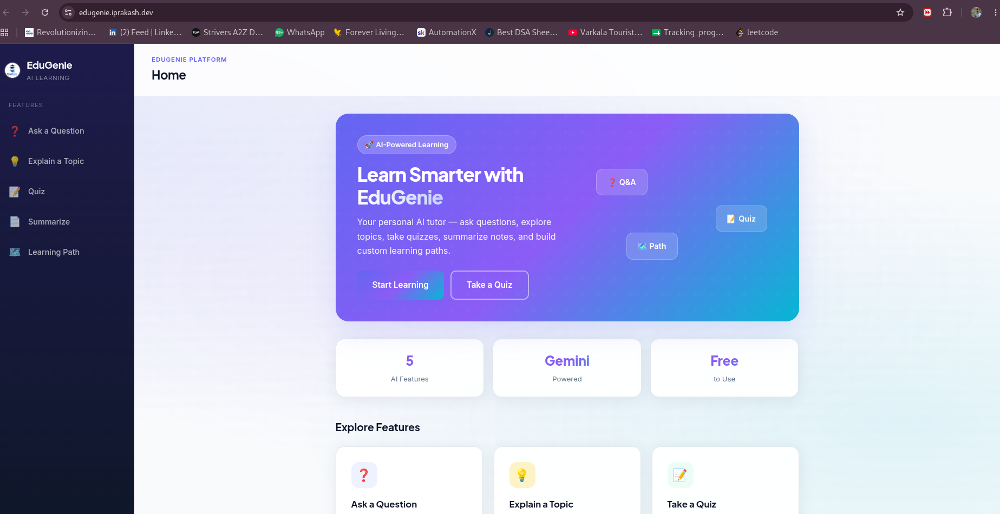
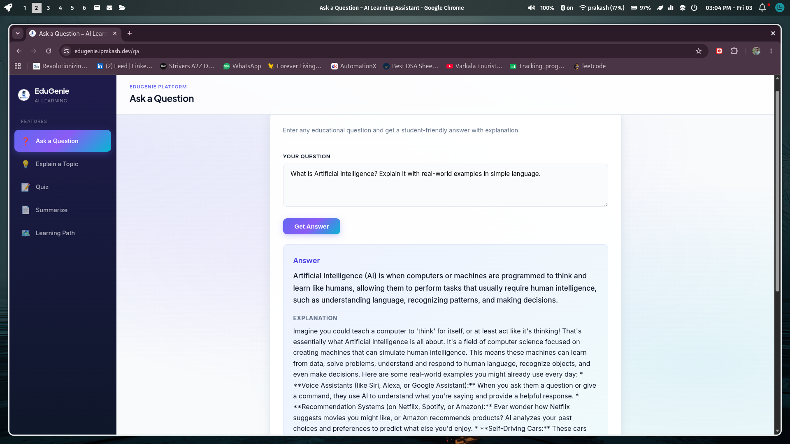
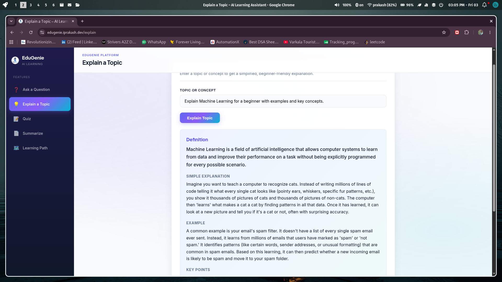
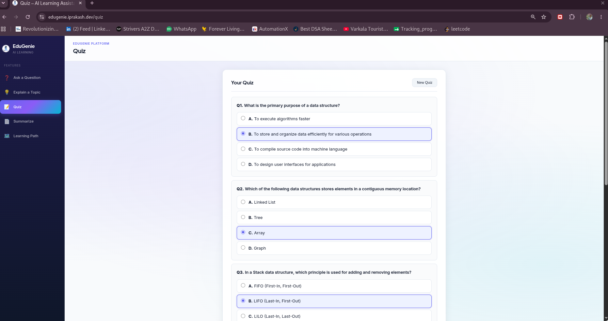
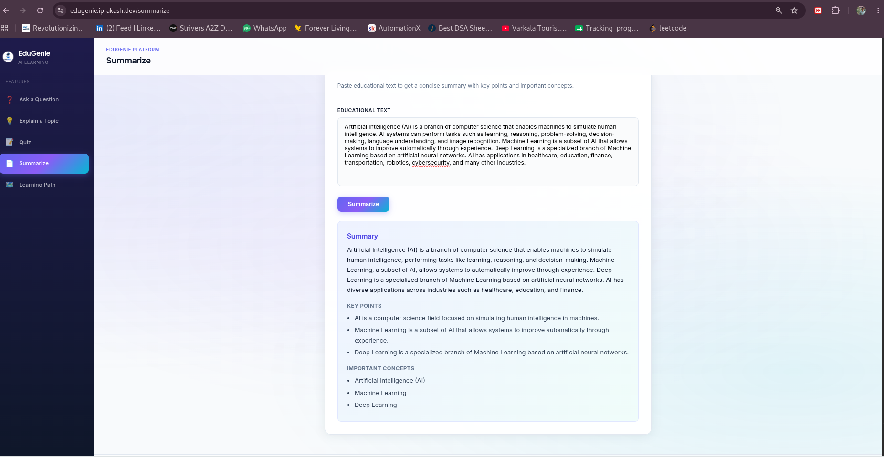
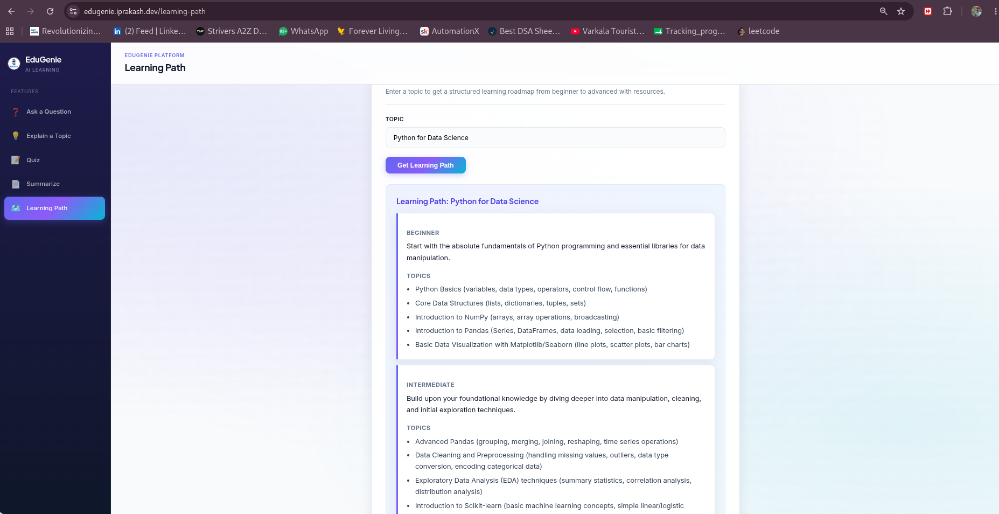
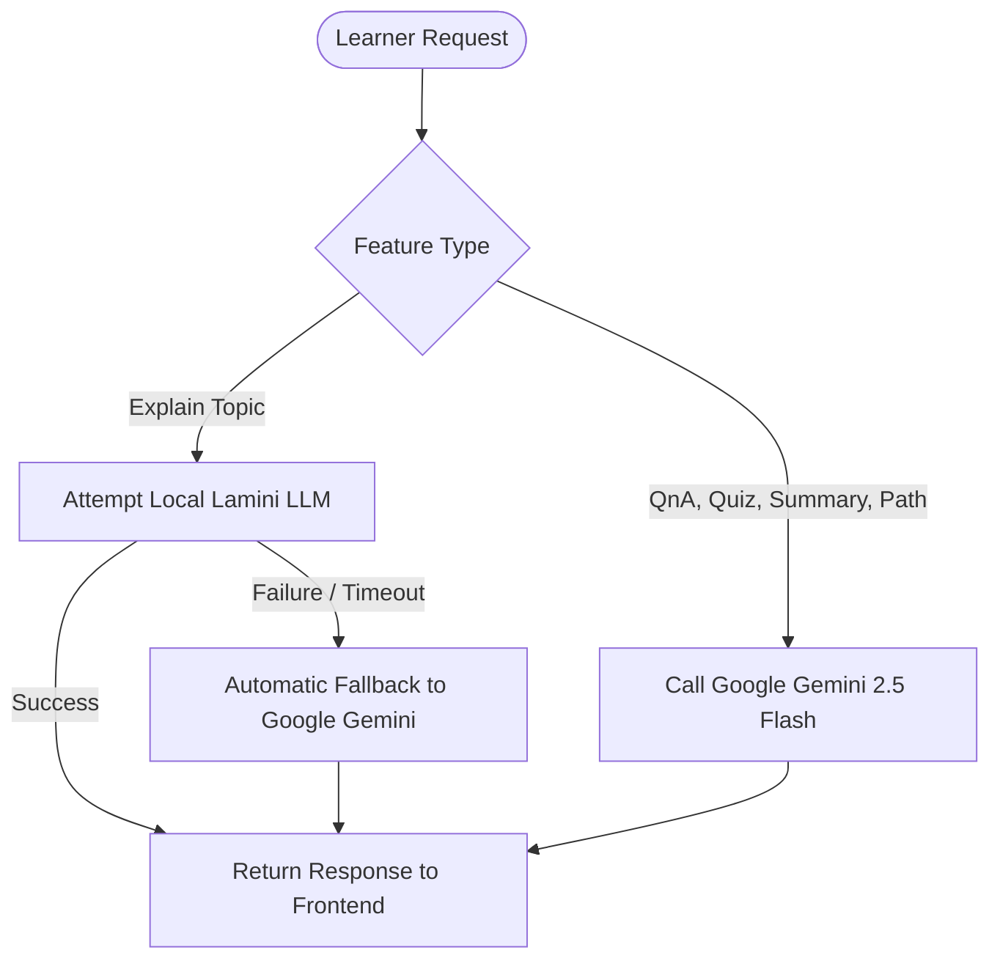

# EduGenie — AI-Powered Learning Assistant

<div align="center">

[](https://fastapi.tiangolo.com/)
[](https://www.python.org/)
[](https://deepmind.google/technologies/gemini/)
[](https://www.docker.com/)

**An advanced AI-powered educational platform designed to streamline and customize the learning experience. EduGenie provides direct question answering, deep concept explanation, interactive self-assessment, text summarization, and personalized learning roadmaps.**

[🚀 Explore Live Demo (Primary)](https://edugenie.iprakash.dev/) &nbsp;|&nbsp; [🌐 Explore Live Demo (Mirror)](https://edugenie-opal.vercel.app/)

</div>

---

## 📸 Platform Showcase & Interactive Demos

Below is a detailed walkthrough of each module inside EduGenie. Click on any **Demo Link** to try that specific feature live.

### 1. Home Dashboard
* **Overview:** A modern, clean portal connecting learners to all of EduGenie's core AI modules.
* **Demo Link:** [Open Home Dashboard](https://edugenie.iprakash.dev/) or [Mirror](https://edugenie-opal.vercel.app/)
* **Preview:**
  

### 2. Ask a Question
* **Overview:** Get instant, accurate responses to educational queries. The module provides a direct answer, a simplified breakdown, and additional learning points to ensure comprehension.
* **Demo Link:** [Ask a Question Live](https://edugenie.iprakash.dev/qa) or [Mirror](https://edugenie-opal.vercel.app/qa)
* **Preview:**
  

### 3. Explain a Topic
* **Overview:** Deep-dives into complex topics by breaking them down into formal definitions, simplified conceptual comparisons, real-world examples, and key bullet points.
* **Demo Link:** [Explain a Topic Live](https://edugenie.iprakash.dev/explain) or [Mirror](https://edugenie-opal.vercel.app/explain)
* **Preview:**
  

### 4. Interactive Quiz
* **Overview:** Enter a topic or paste a block of text to generate customized multiple-choice tests. Complete the quiz and submit for automated grading, instant score calculation, and itemized review.
* **Demo Link:** [Generate a Quiz Live](https://edugenie.iprakash.dev/quiz) or [Mirror](https://edugenie-opal.vercel.app/quiz)
* **Preview:**
  

### 5. Text Summarization
* **Overview:** Paste long articles or educational textbooks to generate a structured digest containing a high-level summary, key takeaways, and a catalog of critical vocabulary/concepts.
* **Demo Link:** [Summarize Text Live](https://edugenie.iprakash.dev/summarize) or [Mirror](https://edugenie-opal.vercel.app/summarize)
* **Preview:**
  

### 6. Structured Learning Path
* **Overview:** Generates structured educational roadmaps mapping a topic from Beginner to Advanced, including milestones, tasks, and recommended external resources.
* **Demo Link:** [Generate Learning Path Live](https://edugenie.iprakash.dev/learning-path) or [Mirror](https://edugenie-opal.vercel.app/learning-path)
* **Preview:**
  

---

## 📂 Project Lifecycle & SDLC Documentation

This repository documents the complete Software Development Life Cycle (SDLC) followed during project development. Below is a breakdown of the phases and associated deliverables:

| Development Phase | Documentation / Artifacts | Description |
| :--- | :--- | :--- |
| **1. Ideation Phase** | 📄 [Define Problem Statements](<1.Ideation Phase/_Define the Problem Statements.docx>)<br>📄 [Brainstorm & Idea Prioritization](<1.Ideation Phase/_Brainstorm & Idea Prioritization.docx>)<br>📄 [Empathize & Discover](<1.Ideation Phase/_Empathize & Discover.docx>) | Establishing target personas, discovering pain points in traditional e-learning, and prioritizing solution ideas. |
| **2. Requirement Analysis** | 📄 [Solution Requirements](<2.Requirement Analysis/_Solution Requirements (Functional & Non-functional).docx>)<br>📄 [Data Flow Diagram & User Stories](<2.Requirement Analysis/_Data Flow Diagram & User Stories.docx>)<br>📄 [Technology Stack & Architecture](<2.Requirement Analysis/_Technology Stack (Architecture & Stack).docx>) | Specifying functional/non-functional requirements, outlining user stories, and establishing the technical stack. |
| **3. Project Design Phase** | 📄 [Proposed Solution Details](<3.Project Design Phase/_Proposed Solution .docx>)<br>📄 [Solution Architecture Design](<3.Project Design Phase/_Solution Architecture.docx>) | Modeling system interactions, data flows, components, and schema structures. |
| **4. Project Planning Phase** | 📄 [Project Planning Timeline](<4.Project Planning Phase/_Project Planning Phase.docx>)<br>📄 [Planning Logic & Milestones](<4.Project Planning Phase/_Planning logic.docx>) | Work breakdown structures, sprint plans, and scheduling logic. |
| **5. Project Development Phase** | 📄 [Functional & Performance Testing](<5.Project Devlopment Phase/_Functional & Performance Testing .docx>) | Test case logs, validation testing, and quality assurance metrics. |
| **6. Project Documentation** | 📄 [Comprehensive Project Report](<6.Project Documentation /_Project Report.docx>) | End-to-end documentation consolidating all phases into a final report. |

---

## 🧠 AI Routing & Architecture

EduGenie employs an intelligent dual-routing mechanism to balance speed, cost, and availability:



* **Topic Explanation Module (`/explain`):** Evaluates requests using a local Lamini model endpoint (`explanation_module.py`). If the endpoint is offline, times out, or fails to parse, it automatically falls back to **Google Gemini** to prevent service disruption.
* **Other Modules (`/qa`, `/quiz`, `/summarize`, `/learning-path`):** Routinely utilize Google Gemini directly to ensure high-fidelity responses.

---

## 🛠️ Local Installation & Setup

Follow these steps to run the EduGenie platform on your local machine:

### 1. Clone & Set Up Virtual Environment
```bash
git clone https://github.com/your-username/EduGenie.git
cd EduGenie

# Create a virtual environment
python -m venv .venv

# Activate virtual environment
source .venv/bin/activate  # On Windows: .venv\Scripts\activate

# Install dependencies
pip install -r requirements.txt
```

### 2. Configure Environment Variables
Create a `.env` file in the root directory by copying the example template:
```bash
cp .env.example .env
```

Edit the `.env` file with your credentials:
```env
GEMINI_API_KEY=your_google_gemini_api_key
GEMINI_MODEL=gemini-flash-latest

# (Optional) Local Lamini Endpoint Config
LAMINI_LOCAL_URL=http://127.0.0.1:8001/v1/generate
LAMINI_MODEL=lamini-local
LAMINI_API_KEY=
```

### 3. Run the Development Server
```bash
uvicorn main:app --reload
```
Navigate to [http://127.0.0.1:8000](http://127.0.0.1:8000) in your web browser.

---

## 🐳 Docker Deployment

To build and run the application inside a lightweight container:

```bash
# Build the Docker image
docker build -t edugenie:latest .

# Run the container (Mapping port 8000)
docker run -d -p 8000:8000 --env-file .env edugenie:latest
```

Alternatively, use Docker Compose:
```bash
docker-compose up -d
```

---

## 📂 Repository Directory Layout

```text
EduGenie/
│
├── 1.Ideation Phase/               # Problem definition & brainstorming deliverables
├── 2.Requirement Analysis/         # Functional/non-functional specification docs
├── 3.Project Design Phase/          # Architecture design and system layout docs
├── 4.Project Planning Phase/        # Timelines, scheduling, and milestone planning
├── 5.Project Devlopment Phase/     # Testing reports and performance diagnostics
├── 6.Project Documentation /        # Consolidated comprehensive project reports
│
├── static/                         # Assets directory
│   ├── images/                     # System screenshots used in documentation
│   ├── edugenie.png                # Favicon and logo asset
│   ├── style.css                   # Custom global stylesheet
│   └── app.js                      # Core frontend logic & API request handlers
│
├── templates/                      # HTML Layouts (Jinja2 templates)
│   ├── base.html                   # Main boilerplate layout (Header, Nav, Footer)
│   ├── index.html                  # Welcome dashboard page
│   ├── qa.html                     # Question answering interface
│   ├── explain.html                # Concept explanation interface
│   ├── quiz.html                   # MCQ quiz generator interface
│   ├── summarize.html              # Text summarization interface
│   └── learning_path.html          # Roadmap generator interface
│
├── main.py                         # FastAPI App startup and API endpoint routing
├── config.py                       # Project configuration & settings loader
├── utils.py                        # Common utility helper functions
├── schemas.py                      # Pydantic validation models
│
├── qna.py                          # Ask a Question AI core
├── explanation_module.py           # Explain Topic AI core (Lamini w/ Gemini fallback)
├── quiz_module.py                  # Interactive Quiz AI core
├── summary_module.py               # Text Summarization AI core
├── learning_path.py                # Learning Path generator AI core
│
├── Dockerfile                      # Production build container config
├── docker-compose.yml              # Multi-container service config
├── render.yaml                     # Render.com IaC specification
├── Procfile                        # Railway / Heroku process manager config
├── requirements.txt                # List of Python dependencies
└── .env.example                    # Sample configuration template
```

---

## 📄 License & Contact

This project is open-source and available under the [MIT License](LICENSE). 

For questions, issues, or suggestions, please contact the repository owner or open an issue on the issue tracker.
